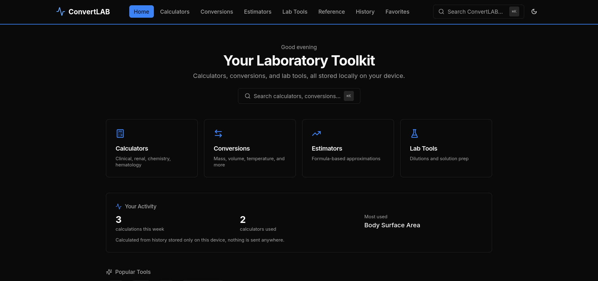

# Clinexia v2.0

Clinexia is a complete clinical toolkit and progressive web app: medical calculators, drug dosing (mg per dose and mL per dose), unit conversions, laboratory tools and reference ranges. This version (v2.0) features a modern frontend built with Next.js, TypeScript, and Tailwind CSS, designed for a smooth, responsive user experience.

---

## Live Demo

[Clinexia v2.0 Live](https://convertlab-nex.vercel.app/)


---

## Tech Stack

- **Next.js** (App Router) - for page routing, server rendering where needed, and fast frontend performance  
- **TypeScript** - static typing for safer, more maintainable code  
- **Tailwind CSS** - utility-first CSS for rapid UI development and consistent design  
- **React hooks / client-side state** - for form handling, conversion logic, and interactive components  
- **GitHub + Vercel** - version control and deployment  

---

## Features

- Clinical calculators, drug dosing with mg and mL per dose, and unit conversion for clinical and laboratory metrics  
- Responsive layout, mobile & desktop friendly  
- Real-time input validation and conversion feedback  
- Modular component architecture (conversion cards, input fields, selection controls)  
- Clean, user-friendly UI  

---

## Project Structure

```

/app                   ─ Next.js pages/components (routes, layout, etc.)
/components            ─ Reusable React components (cards, inputs, buttons, etc.)
/hooks                 ─ Custom React hooks for state & logic
/lib                   ─ Utility functions (conversion algorithms, helpers)
/public                ─ Static assets (images, icons, etc.)
/styles                ─ Global and Tailwind config/style overrides
next.config.mjs        ─ Next.js configuration
tailwind.config.ts     ─ Tailwind configuration
tsconfig.json          ─ TypeScript configuration

````

---

## Installation & Setup

```bash
git clone https://github.com/dBillionaire-Dev/ConvertLAB_v2.0.git
cd ConvertLAB_v2.0
# Use npm or your preferred package manager
npm install
# or
yarn install
# or
pnpm install

# Run in development mode
npm run dev
# or
yarn dev
# or
pnpm dev
````

Visit `http://localhost:3000` (or whatever port your setup uses) to view.

---

## How to Use

1. From the home page, select the conversion or calculator tool you want (e.g. BMI, temperature, chemical units, etc.).
2. Input the value(s) to convert.
3. View the result immediately after input, with real-time feedback or validation.

---

## Future Improvements (Ideas)

* Add theme toggle (dark/light mode)
* Add more unit types (e.g. more chemical units, more complex lab metrics)
* Improve accessibility (keyboard navigation, screen reader support)
* Add localization/multi-language support
* Unit tests / integration tests for conversion logic

---

## Author

**dBillionaire-Dev**

---

## Contact

For issues or feature requests, open a GitHub issue in this repo or contact me via email / social profile

## Anonymous Usage Analytics

Clinexia can record successful calculator usage without requiring users to register. Each browser gets an anonymous installation ID, and calculation events are first placed in an IndexedDB outbox so usage is retained while offline. When connectivity returns, pending events are uploaded to the Next.js analytics API and stored in Supabase.

### Setup

1. Create a Supabase project.
2. Run `supabase/analytics.sql` in the Supabase SQL Editor.
3. Add the variables from `.env.example` to your local environment and Vercel:
   - `SUPABASE_URL`
   - `SUPABASE_SERVICE_ROLE_KEY` (server-only)
   - `ADMIN_PASSWORD`
   - `ADMIN_SESSION_SECRET` (at least 32 characters)
4. Open `/admin` and sign in with `ADMIN_PASSWORD`.

The implementation records tool metadata and timestamps, not calculator input values or patient identifiers.

Offline events remain in the browser's IndexedDB until the server confirms receipt. The analytics API is intentionally outside the calculator's critical path, so a failed network request never prevents a calculation from working.

### Analytics console

`/admin` provides total calculations, today's usage, seven-day usage, offline-synced calculations, top calculators, category usage, and a 14-day usage chart.

### Existing history backfill

When analytics is first enabled, Clinexia performs a one-time migration of calculation history that is still present in the user's local IndexedDB. Historical entries are queued using their existing history IDs, so an interrupted migration can safely retry without double-counting. Only calculator metadata and timestamps are sent; existing calculation inputs and results remain local. Historical entries are labelled separately in the admin console as **Historical backlog**.

## Anonymous Usage Analytics

Clinexia can record calculator usage without requiring users to register. Events are queued locally in IndexedDB first, so calculations made offline can sync later when connectivity returns. The `/admin` management console shows aggregate usage across the deployed application.

Analytics can distinguish:
- `web` - normal browser usage
- `pwa` - installed/standalone PWA usage
- deployment `environment` - configured with `NEXT_PUBLIC_APP_ENV`
- `appVersion` - application version recorded by the tracker
- historical backlog - calculations imported once from an existing user's local History

The analytics implementation does not send calculator inputs or results. Run `supabase/analytics.sql` in Supabase before enabling the server-side analytics API.

<!-- clinexia-distribution -->
## Landing page, domains and app stores

### Landing page and two domains

The landing page lives at `/welcome`. With two domains configured, the **landing domain** shows it at `/` and redirects every app page to the **app domain** (`proxy.ts`). Nothing happens until the variables below are set, and hosts that are not listed (localhost, preview deployments, the old address) behave as before.

| Variable | Example | Purpose |
|---|---|---|
| `NEXT_PUBLIC_LANDING_URL` | `https://example.com` | the marketing landing page |
| `NEXT_PUBLIC_APP_URL` | `https://app.example.com` | the web app / PWA |
| `NEXT_PUBLIC_SITE_URL` | `https://app.example.com` | metadata, robots and sitemap of the app |
| `NEXT_PUBLIC_LEGACY_HOSTS` + `NEXT_PUBLIC_LEGACY_REDIRECT=on` | `old-address.vercel.app` | optional: retire an old address by redirecting it to the app domain |

Variables starting with `NEXT_PUBLIC_` are baked in at build time: redeploy after changing them.

### Download buttons on the landing page

A channel with no URL shows "coming soon". Nothing is invented.

| Variable | What it enables |
|---|---|
| `NEXT_PUBLIC_PLAY_STORE_URL` | Google Play button |
| `NEXT_PUBLIC_FIREBASE_DIST_URL` | Firebase App Distribution beta invite link |
| `NEXT_PUBLIC_APK_URL`, `NEXT_PUBLIC_APK_SHA256`, `NEXT_PUBLIC_APK_VERSION` | direct APK download, with its checksum shown |
| `NEXT_PUBLIC_MS_STORE_URL` | Microsoft Store button |
| `NEXT_PUBLIC_IARC_RATING_ID` | age-rating id written into the web manifest (Microsoft Store) |

The Android build, signing, Firebase and Google Play steps are in the mobile repository (`docs/RELEASE.md`).

### Windows: Microsoft Store with PWABuilder

The web manifest (`app/manifest.ts`) is written to pass [PWABuilder](https://www.pwabuilder.com): a stable `id` and `scope`, `standalone` display, 192 and 512 px icons (including maskable), wide and narrow screenshots, shortcuts, categories, Edge side-panel and launch-handler hints, and optional `iarc_rating_id` and related-application entries.

1. Deploy the app on HTTPS at the app domain.
2. Open pwabuilder.com, enter the app URL and press **Start**. The Manifest, Service Worker and Security sections should pass. Fix anything it lists.
3. **Package for stores → Windows.** Fill in the package id, publisher id and publisher display name from Microsoft Partner Center (Product identity), then generate the package.
4. In Partner Center: reserve the name, upload the package, complete the age-rating questionnaire (copy the IARC id into `NEXT_PUBLIC_IARC_RATING_ID` and redeploy), add screenshots (`/screenshots/wide-*.png`) and a privacy policy URL (state the anonymous usage statistics honestly).
5. When it is published, set `NEXT_PUBLIC_MS_STORE_URL` and redeploy.

### Drug doses: mg per dose and mL per dose

Single-drug dosing calculators show the dose in mg for one administration. Enter the product strength from its label (for example 125 mg in 5 mL) and they also show the volume per dose in mL. With no strength entered, no volume is shown, and nothing is assumed. Tablet-band regimens, fixed-dose combinations, fluids, infusion rates and multi-drug protocols are deliberately excluded. The logic is in `lib/calculators/dose-volume.ts`.
